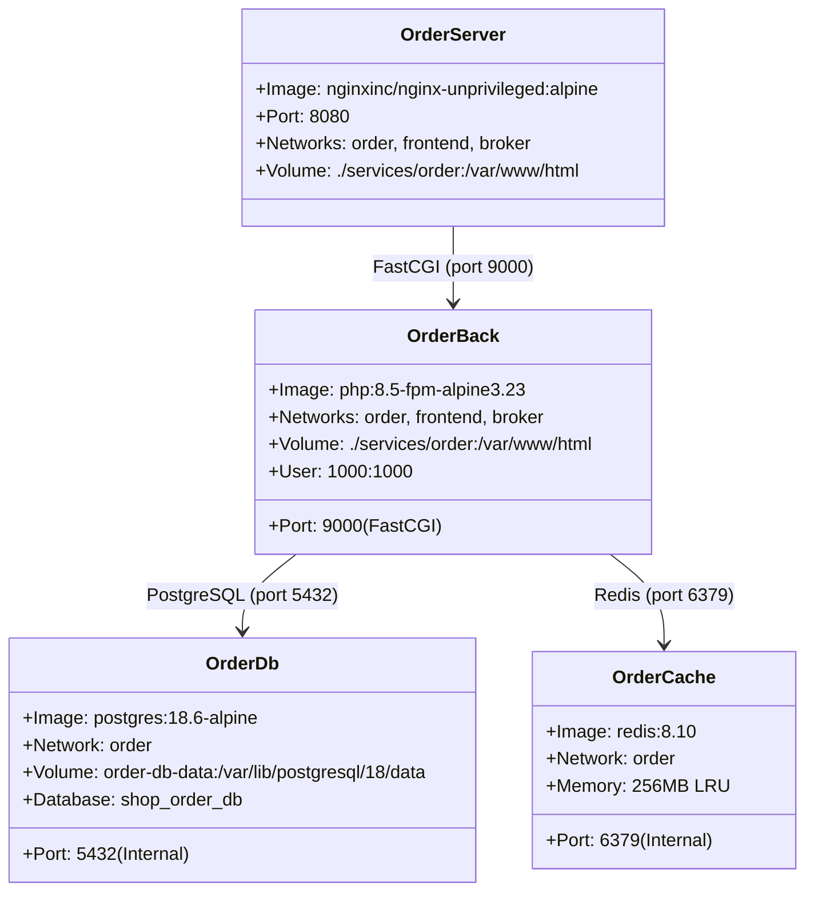

# Data Model & Configuration Schema: Order Service Infrastructure

**Date**: 2026-09-15
**Feature**: [spec.md](./spec.md)

## 1. Environment & Configuration Schema

The Order service configuration is driven by standard environment variables defined in `.env` and injected into container runtimes.

| Variable Name | Default Value | Description | Sensitivity |
| :--- | :--- | :--- | :--- |
| `ORDER_PG_USER` | `order-user` | PostgreSQL database username | Low |
| `ORDER_PG_PASSWORD` | `order-pass` | PostgreSQL database password | High |
| `ORDER_PG_DB` | `shop_order_db` | PostgreSQL database name | Low |
| `ORDER_REDIS_PASSWORD` | `redis-pass` | Redis authentication password | High |
| `WWWUSER` | `1000` | Host user ID for PHP container volume permissions | Low |
| `WWWGROUP` | `1000` | Host group ID for PHP container volume permissions | Low |

---

## 2. Container Service Models

---

## 3. Database Schema (Initial Baseline)

The Order service utilizes PostgreSQL (`shop_order_db`). The infrastructure baseline includes standard Laravel system tables and the foundation for domain migrations.

### Standard System Tables:
- `migrations`: Tracks migration execution state.
- `failed_jobs`: Captures failed queue jobs (broker fallback).
- `personal_access_tokens`: Token store for Sanctum (if used for API tokens).

### Domain Entity Baseline:
- `orders` (to be expanded in subsequent domain features):
  - `id`: UUID / BigInteger Primary Key
  - `user_id`: UUID (reference to Auth domain entity)
  - `status`: Enum (`pending`, `paid`, `processing`, `completed`, `cancelled`)
  - `total_amount`: Decimal(10, 2)
  - `currency`: String(3)
  - `created_at`, `updated_at`: Timestamps
